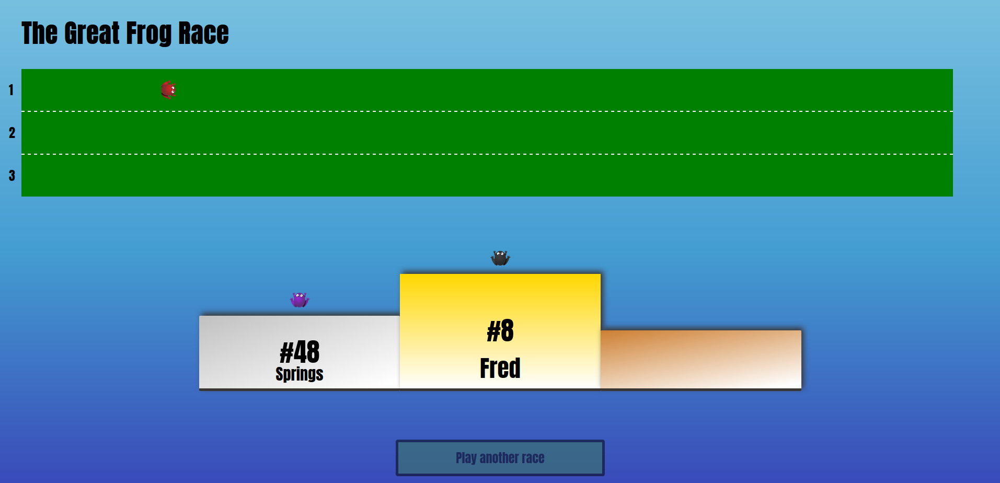

# The Great Frog Race

> JavaScript OOP Exercise for Concordia University

<div align='center'>
  
</div><br>

## Features

1. Watch the frogs race to the finish line. Bet on who you think the winner will be!

## Demo

[View Live](https://andrewbaldwin44.github.io/The_Great_Frog_Race/)

## Deploy the project

__Clone the repo to your local machine using the terminal__:
```
$ git clone git@github.com:andrewbaldwin44/The_Great_Frog_Race.git
```

*Then Open the `index.html` Project File in Your Browser*

### Technologies Used:

- JavaScript
- HTML
- CSS

## Author

👤 **Andrew Baldwin**

- Github: [@andrewbaldwin44](https://github.com/andrewbaldwin44)
